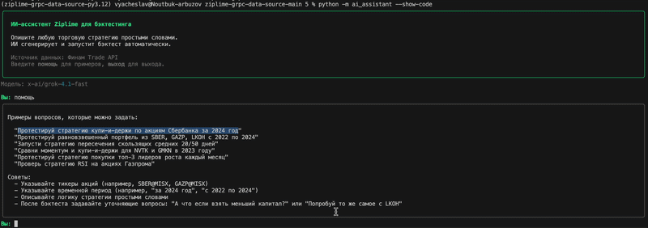

# zipFinam

Источник рыночных данных на основе Финма Trade API для фреймворка [Ziplime](https://github.com/Limex-com/ziplime) — адаптер для подключения к API брокера **Финам** и работы с российским фондовым рынком.

---

## Описание

**zipFinam** — это форк-расширение библиотеки Ziplime, предназначенное для российского рынка. Пакет обеспечивает получение исторических рыночных данных и информации об активах через gRPC-API брокера Финам (торговая площадка MOEX/Московская биржа).

В комплект входит встроенный **ИИ-ассистент**, который позволяет описывать торговые стратегии на естественном языке и автоматически запускать бэктесты.

---

## Возможности

- **Интеграция с Финам Trade API** — прямое подключение к данным российских ценных бумаг
- **Исторические котировки** — загрузка OHLCV-данных в таймфреймах от M1 до MN (месяц)
- **Каталог активов** — получение списка инструментов и бирж с маппингом тикеров
- **Асинхронная архитектура** — параллельная загрузка данных через пул потоков
- **ИИ-ассистент** — создание и запуск бэктестов по описанию стратегии на русском языке
- **Автоматическая установка базы данных** — файл `assets.sqlite` копируется в `~/.ziplime/` при первом импорте пакета

---

## Установка

```bash
pip install zipfinam
```

При установке пакет автоматически разместит базу данных активов в:

```
~/.ziplime/assets.sqlite
```

---

## Быстрый старт

### Настройка окружения

Создайте файл `.env` (или задайте переменные окружения):

```env
GRPC_TOKEN=ваш_jwt_токен_финам
GRPC_SERVER_URL=api.finam.ru:443
GRPC_MAXIMUM_THREADS=8
```

Токен JWT для доступа к API Финам выдаётся через личный кабинет брокера.

### Загрузка исторических данных

```python
import asyncio
from ziplime_grpc_data_source import GrpcDataSource

data_source = GrpcDataSource(
    grpc_token="ваш_токен",
    grpc_server_url="api.finam.ru:443",
)

# Загрузка данных по акциям Сбербанка и Газпрома
asyncio.run(data_source.ingest(
    symbols=["SBER@MISX", "GAZP@MISX"],
    start="2024-01-01",
    end="2025-01-01",
))
```

### Загрузка каталога активов

```python
from ziplime_grpc_data_source import GrpcAssetDataSource

asset_source = GrpcAssetDataSource(
    grpc_token="ваш_токен",
    grpc_server_url="api.finam.ru:443",
)

asyncio.run(asset_source.ingest())
```

---

## Поддерживаемые таймфреймы

| Код    | Описание        |
|--------|-----------------|
| `M1`   | 1 минута        |
| `M5`   | 5 минут         |
| `M15`  | 15 минут        |
| `M30`  | 30 минут        |
| `H1`   | 1 час           |
| `H2`   | 2 часа          |
| `H4`   | 4 часа          |
| `H8`   | 8 часов         |
| `D`    | День            |
| `W`    | Неделя          |
| `MN`   | Месяц           |
| `QR`   | Квартал         |

---

## ИИ-ассистент



Встроенный ИИ-ассистент позволяет создавать и тестировать торговые стратегии на русском языке без программирования.

### Запуск

```bash
# Установите API-ключ OpenRouter
export OPENROUTER_API_KEY=ваш_ключ

# Запустите ассистента (интерактивный выбор модели)
python -m ai_assistant

# Запустите с моделью по умолчанию (без выбора)
python -m ai_assistant --default-model

# Показывать сгенерированный код стратегии
python -m ai_assistant --show-code
```

### Доступные модели

При запуске без `--default-model` отображается меню выбора модели:

| Категория | Модели |
|-----------|--------|
| **Бесплатные** | `nvidia/nemotron-3-super-120b-a12b:free`, `qwen/qwen3-next-80b-a3b-instruct:free`, `z-ai/glm-4.5-air:free` *(по умолчанию)*, `stepfun/step-3.5-flash:free` |
| **Платные (РФ)** | `deepseek/deepseek-v3.2`, `xiaomi/mimo-v2-flash`, `qwen/qwen3-coder-next`, `z-ai/glm-5`, `moonshotai/kimi-k2.5` |
| **Платные (не РФ)** | `google/gemini-3.1-flash-lite-preview`, `x-ai/grok-code-fast-1`, `openai/gpt-5-mini` |

Модель можно задать через переменную окружения (тогда меню пропускается):
```bash
export OPENROUTER_MODEL=deepseek/deepseek-v3.2
```

### Примеры запросов

```
Протестируй стратегию купи-и-держи по акциям Сбербанка за 2024 год
Запусти равновзвешенный портфель из SBER, GAZP, LKOH, GMKN с 2022 по 2024
Проверь стратегию пересечения скользящих средних 20/50 на акциях Газпрома
Сравни моментум и купи-и-держи для NVTK и GMKN в 2023 году
```

### Команды CLI

| Команда         | Действие                        |
|-----------------|---------------------------------|
| `помощь`        | Показать примеры запросов       |
| `очистить`      | Сбросить историю разговора      |
| `выход`         | Выйти из программы              |

---

## Примеры

В папке `examples/` находятся готовые скрипты:

- `ingest_assets_data_grpc.py` — загрузка каталога активов
- `ingest_data_grpc.py` — загрузка исторических котировок (SBER, UGLD, UKUZ, WUSH)
- `run_simulation_daily_grpc.py` — запуск дневной симуляции
- `algorithms/test_algo/test_algo.py` — пример алгоритма равновзвешенного портфеля

---

## Структура проекта

```
ziplime_grpc_data_source/
├── grpc_data_source.py        # Загрузка исторических данных из gRPC
├── grpc_asset_data_source.py  # Загрузка активов и бирж из gRPC
├── assets.sqlite              # База данных активов (копируется в ~/.ziplime/)
└── grpc_stubs/                # Сгенерированные Protocol Buffer стабы
    └── grpc/tradeapi/v1/
        ├── auth/              # Сервис аутентификации
        ├── assets/            # Сервис активов
        ├── accounts/          # Сервис счетов
        ├── marketdata/        # Сервис рыночных данных
        └── orders/            # Сервис ордеров

ai_assistant/
├── agent.py                   # LLM-агент (OpenRouter)
├── cli.py                     # Интерактивный CLI на русском языке
├── data_manager.py            # Управление данными Финам API
├── executor.py                # Запуск бэктестов
└── prompts.py                 # Системные промпты на русском языке
```

---

## Зависимости

- Python >= 3.12
- [ziplime](https://github.com/Limex-com/ziplime) >= 1.11.11
- grpcio >= 1.76.0
- googleapis-common-protos >= 1.72.0

Для ИИ-ассистента дополнительно:
- openai >= 1.0.0 (клиент OpenRouter)
- rich >= 13.0.0
- python-dotenv >= 1.0.0
- quantstats >= 0.0.81 (HTML-отчёты по стратегиям)

---

## Лицензия

Apache License 2.0
