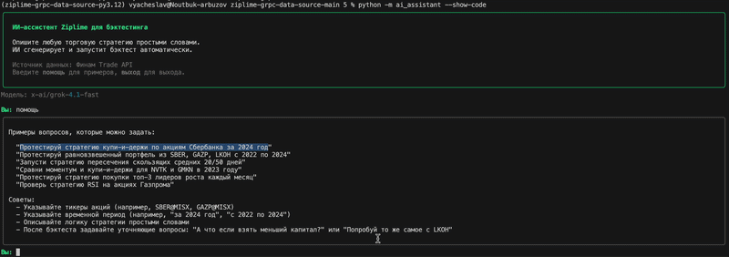

Российский рынок для [ziplime](https://github.com/Limex-com/ziplime). Бэктестинг на MOEX без боли.

> Потому что `yfinance` тут не поможет.

---

## Что это

[ziplime](https://github.com/Limex-com/ziplime) — движок бэктестинга и живой торговли, сделанный
для американского рынка. **zipFinam** ставится поверх него и добавляет то, что нужно стратегии
на Мосбирже:

| Что | Откуда | Зачем |
|---|---|---|
| Бары и справочник инструментов | Финам Trade API | Котировки акций и фондов MOEX от минуты до квартала |
| Таблицы MOEX AlgoPack | `algopack://` в `data.history` | Поток заявок, стакан, концентрация, открытый интерес: то, чего нет в барах |
| Календарь FORTS | `exchange_calendars` | Срочный рынок до 23:50, а не до 18:45, как у XMOS |
| Исполнение заявок | Финам Arena или реальный счёт | От бэктеста к торговле без переписывания стратегии |
| ИИ-ассистент | OpenRouter | Стратегию описываете словами по-русски, код и бэктест он делает сам |

Стратегия остаётся обычной стратегией ziplime: те же `initialize` и `handle_data`, те же
`order_target_percent` и `data.history`.

---

## Установка

```bash
pip install "zipfinam[all] @ git+https://github.com/arbuzovv/zipFinam"
```

Нужен Python 3.12+. Вместе с пакетом ставится ziplime 2.x. Если нужно не всё, выберите extras:

| Extra | Что добавляет |
|---|---|
| — | Данные Финам, календари, схему `algopack://` (без клиента AlgoPack) |
| `algopack` | Клиент MOEX AlgoPack (`moexalgo`) |
| `live` | Исполнение заявок через Финам (`finam-trade-api`) |
| `ai` | ИИ-ассистент и отчёты QuantStats |

### Ключи

Создайте `.env` в папке, где будете запускать. В git его не кладите, он уже в `.gitignore`.

```env
GRPC_TOKEN=токен_Финам_Trade_API        # выдаётся в личном кабинете, https://api.finam.ru
ALGOPACK_API=ключ_MOEX_AlgoPack          # https://data.moex.com, нужна подписка
OPENROUTER_API_KEY=ключ_OpenRouter       # https://openrouter.ai, есть бесплатные модели
```

Для бэктестов на барах хватит `GRPC_TOKEN`. `ALGOPACK_API` нужен только стратегиям, которые
читают AlgoPack, `OPENROUTER_API_KEY` — только ассистенту.

---

## ИИ-ассистент



С него проще всего начать. Вы пишете, что хотите проверить, а ассистент подбирает тикеры, пишет
код, загружает данные Финам, запускает бэктест и объясняет результат.

```bash
zipfinam-ai                     # или: python -m zipfinam.assistant
zipfinam-ai --default-model     # без меню выбора модели
zipfinam-ai --show-code         # показывать код стратегии
```

Примеры запросов:

```
Протестируй стратегию купи-и-держи по акциям Сбербанка за 2024 год
Запусти равновзвешенный портфель из SBER, GAZP, LKOH, GMKN с 2022 по 2024
Проверь стратегию пересечения скользящих средних 20/50 на акциях Газпрома
Покупай бумаги, где агрессивные покупатели перевешивают продавцов по AlgoPack
```

Команды в чате: `помощь`, `очистить`, `выход`. При первом запуске ассистент один раз скачивает
список инструментов Финам в `~/.ziplime/assets.sqlite`.

### Модели

| Категория | Модели |
|-----------|--------|
| **Бесплатные** | `nvidia/nemotron-3-super-120b-a12b:free`, `qwen/qwen3-next-80b-a3b-instruct:free`, `z-ai/glm-4.5-air:free` *(по умолчанию)*, `stepfun/step-3.5-flash:free` |
| **Платные (РФ)** | `deepseek/deepseek-v3.2`, `xiaomi/mimo-v2-flash`, `qwen/qwen3-coder-next`, `z-ai/glm-5`, `moonshotai/kimi-k2.5` |
| **Платные (не РФ)** | `google/gemini-3.1-flash-lite-preview`, `x-ai/grok-code-fast-1`, `openai/gpt-5-mini` |

Любую модель OpenRouter можно задать в переменной `OPENROUTER_MODEL`, тогда меню не появится.

---

## Бэктест вручную

Скрипты лежат в [`examples/`](examples) и запускаются из этой папки:

```bash
cd examples
python ingest_finam.py                                    # 1. справочник и дневные бары из Финам
python run_backtest.py                                    # 2. купи-и-держи на голубых фишках
python run_backtest.py algorithms/algopack/flow_tilt.py   #    то же на сигнале AlgoPack
```

Что торговать и за какой период, задаётся в [`examples/settings.py`](examples/settings.py).
Стратегия — обычный файл ziplime:

```python
from ziplime.finance.execution import MarketOrder


async def initialize(context):
    context.stocks = [await context.symbol(s) for s in ("SBER@MISX", "GAZP@MISX")]


async def handle_data(context, data):
    for stock in context.stocks:
        bars = await data.history(assets=[stock], fields=["close"], bar_count=50)
        if len(bars) < 50:
            continue
        closes = bars["close"].to_numpy()
        target = 0.5 if closes[-20:].mean() > closes.mean() else 0.0
        await context.order_target_percent(asset=stock, target=target, style=MarketOrder())
```

Тикеры пишутся с кодом площадки: `SBER@MISX`. Не называйте свои переменные `context.assets`:
это имя занято движком.

Провайдер Финам регистрируется в ziplime сам, поэтому его можно получить и по имени:

```python
from ziplime.utils.bundle_utils import get_asset_data_source, get_market_data_source

assets = get_asset_data_source("finam")
bars = get_market_data_source("finam")
```

Таймфреймы Финам: `M1`, `M5`, `M15`, `M30`, `H1`, `H2`, `H4`, `H8`, `D`, `W`, `MN`, `QR`. Нужный
выбирается по `data_frequency` при загрузке.

---

## MOEX AlgoPack

AlgoPack считает статистику по самой ленте сделок и стакану. Поэтому он знает то, чего нет в
баре: какая сторона пересекала спред, насколько сконцентрирован объём, сколько позиций у
физлиц на срочном рынке. zipFinam подключает его таблицы как источники данных ziplime:

```python
import zipfinam  # добавляет схему algopack:// в data.history

flow = await data.history(assets=[sber], fields=["disb", "val"], bar_count=5,
                          data_source="algopack://eq/tradestats")
```

Адрес имеет вид `algopack://рынок/таблица[/гранулярность]`:

| Таблица | Что внутри | Рынки |
|---|---|---|
| `tradestats` | Цены, объёмы, раздел на покупки и продажи (`disb`) | `eq`, `fo`, `fx` |
| `orderstats` | Выставленные и снятые заявки | `eq`, `fo`, `fx` |
| `obstats` | Спред, глубина и дисбаланс стакана | `eq`, `fo`, `fx` |
| `hi2` | Концентрация объёма (индекс Херфиндаля) | `eq`, `fo` |
| `alerts` | Аномалии, редкие события | `eq`, `fo`, `fx` |
| `futoi` | Открытый интерес физлиц и юрлиц | `fo` |

По умолчанию одна строка — одна торговая сессия: объёмы сложены, VWAP взвешены, дисбаланс
пересчитан по итогам дня. Пятиминутки, как их публикует биржа, доступны по адресу с `/5min`
или явно:

```python
from zipfinam.algopack import algopack_dataset


async def initialize(context):
    context.flow = algopack_dataset(context, "tradestats", granularity="5min")
```

**Данных из будущего стратегия не видит.** Каждая строка становится доступна в момент, когда
биржа её опубликовала (`systime`), а не в момент, к которому она относится. Сессия видит итог
вчерашнего дня, но не свой. `hi2` публикуется с задержкой около шести минут, это учтено. Строки,
которые биржа пересчитала задним числом, иногда спустя месяцы, привязаны к концу своего периода.
Иначе они пропали бы из всех бэктестов до даты пересчёта.

Пять примеров стратегий, по одной на таблицу, лежат в
[`examples/algorithms/algopack/`](examples/algorithms/algopack).

Учтите, что день AlgoPack длиннее дня XMOS. Биржа считает с 07:00 до 23:50, а основная сессия
акций идёт с 10:00 до 18:45. Поэтому `vol` и `pr_close` включают утро и вечер, когда стратегия на
XMOS торговать не может. Для сигнала по потоку заявок это неважно, для сравнения с баром важно.

---

## Календари

В `exchange_calendars` есть только XMOS, сессия фондового рынка до 18:45. Вечерняя сессия
срочного рынка в него не попадает, и фьючерсная стратегия на XMOS теряет четыре часа в день.
zipFinam добавляет календарь `FORTS`: торги с 09:00 до 23:50, клиринг с 18:50 до 19:05,
праздники берутся из XMOS.

```python
from zipfinam import calendar_for_mic, clock_calendar_name

calendar_for_mic("RTSX").name              # 'FORTS'
clock_calendar_name(["MISX", "XNYS"])      # '24/5': общие часы для Москвы и Нью-Йорка
```

`clock_calendar_name` подскажет, какой календарь передать в `run_simulation`, если в портфеле
бумаги нескольких площадок. Свою площадку можно добавить через переменную
`ZIPLIME_VENUE_CALENDARS="MEXC=24/7,XHKG=XHKG"`.

---

## Живая торговля через Финам

Arena (бумажный счёт, `https://arena.finam.ru`) и боевой Trade API (`https://api.finam.ru`)
говорят на одном протоколе, отличается только адрес. По умолчанию пример торгует на Arena:

```bash
pip install "zipfinam[live] @ git+https://github.com/arbuzovv/zipFinam"
export GRPC_TOKEN=...          # котировки, бары, размер лота
export FINAM_TRADE_TOKEN=...   # токен счёта, на котором исполняются заявки
export FINAM_ACCOUNT_ID=...
cd examples && python run_live_finam.py
```

Чтобы торговать реальными деньгами, адрес нужно задать явно:
`export FINAM_TRADE_URL=https://api.finam.ru`.

Как ведёт себя исполнение:

- **Стратегия торгует своим капиталом, а не всем счётом.** `capital_limit` задаёт её долю:
  `order_target_percent(0.5)` означает половину выделенного капитала. Видит стратегия только
  свои бумаги.
- **Лоты.** Количество округляется вниз до целого лота (GAZP торгуется по 10 штук), остаток
  меньше лота не отправляется. Если размер лота прочитать не удалось, заявка не уходит вовсе.
- **Принятая заявка ещё не исполнена.** После каждого тика пример спрашивает брокера, что стало
  с заявками (`refresh_order_states`). Отклонённая брокером заявка попадает в лог как ошибка.
- **Неверный токен** называется прямо (`BrokerAuthError`), а не всплывает где-то глубже как
  `KeyError`.

Тот же Trade API доступен и по gRPC: `zipfinam.exchanges.FinamGrpcExchange`.

---

## Переход с 0.x

- Нужен ziplime 2.x, на 1.x пакет не работает.
- Импорты: `from zipfinam import FinamDataSource, FinamAssetDataSource`. Старый модуль
  `ziplime_grpc_data_source` оставлен на время перехода.
- Готовый `assets.sqlite` больше не копируется при импорте: у ziplime 2.x другая схема базы.
  Справочник загружается из Финам скриптом `examples/ingest_finam.py` или ассистентом при первом
  запуске.
- Ассистент запускается командой `zipfinam-ai` вместо `python -m ai_assistant`.
- В стратегиях `data.history` и `data.current` теперь вызываются с `await`, а у заявок обязателен
  `style=MarketOrder()`.

## Ограничения

- Из справочника Финам импортируются акции и фонды. Фьючерсы и опционы пропускаются: как акции
  они торговались бы с множителем 1.
- Схема `algopack://` подключается обёрткой над `TradingAlgorithm._resolve_named_data_source`,
  поэтому `import zipfinam` должен выполниться до запуска симуляции. Примеры и ассистент так и
  делают.

---

## Структура

```
zipfinam/
├── finam/               # Финам: бары, справочник, исполнение (REST и gRPC), статусы заявок, лоты
├── algopack/            # MOEX AlgoPack: каталог таблиц, клиент, источник данных
├── venue_calendars.py   # FORTS и календари площадок
├── provider.py          # регистрация провайдера finam в ziplime
└── assistant/           # ИИ-ассистент
examples/                # загрузка, бэктест, живая торговля, стратегии
tests/                   # офлайн-тесты: сеть Финам и MOEX подменена
```

Тесты: `pip install -e ".[dev]" && pytest`.

## Лицензия

GNU GPL v3, как у ziplime.
